# 🚀 IncryptX - Advanced Solana DeFi Ecosystem

<div align="center">


[](https://github.com/GHX5T-SOL/incryptX)
[](https://github.com/GHX5T-SOL/incryptX/fork)
[](https://github.com/GHX5T-SOL/incryptX/issues)
[](#license--usage)

[](https://incryptx-demo.vercel.app)
[](https://solana.com/)
[](https://reactjs.org/)
[](https://www.typescriptlang.org/)

[](https://incryptx-demo.vercel.app)
[](https://x.com/Incrypt_defi)

</div>

---

## 🎯 Overview

**IncryptX** is a next-generation, comprehensive DeFi platform built on Solana, featuring advanced smart contract architecture with 6 core Anchor programs. Our platform integrates a permissionless Launchpad, sophisticated Trading Terminal, Decentralized Perpetuals, Social Networking, and AI-powered features into a unified ecosystem.

### 🔥 Key Highlights

- **6 Production-Ready Solana Programs** with comprehensive Anchor framework integration
- **Advanced AMM with X-Curve Mechanics** - Hybrid bonding curves with dynamic liquidity
- **AI-Powered Anti-Vamp Protection** - Prevents token duplication and rug pulls
- **Decentralized Perpetuals** - Up to 100x leverage with isolated AMM pools
- **Social Layer** - On-chain Twitter-like feed with NFT rewards
- **Multi-DEX Integration** - Seamless migration across Raydium, Meteora, and more

---

## 🏗️ Architecture Overview

```mermaid
graph TB
    subgraph "Solana Blockchain"
        subgraph "IncryptX Programs"
            LP[🚀 Launchpad Program<br/>EUaDL98zaBthDc4qs9m3E3eUyvt8Wdhsmo2nEUiaH25d]
            BC[📈 Bonding Curve Program<br/>HRSjxaajaTm4rHNKoZYYLHoJpZb7AGTWGjA6wJPy5zY]
            SW[🔄 Swap Program<br/>BSArzmxcSupt9tzgfQshu1xmWfBWtGDLNX7ZTvbaAfV5]
            TR[📊 Trade Program<br/>HcrFFAHWXkBE7A6YZz9XYHbcCKAXb9uQxWWf1N87NTeB]
            PP[⚡ Perps Program<br/>6ediRNZoe7QEFdZHFedfJVvYkwiGRXgqnqvdzP9Rw9TQ]
            ST[🏦 Staking Program<br/>3Fqt5PDL8snXSoZ9SV2dEdVRbszNY179pWPrMV3HvnjG]
            PR[👤 Profiles Program<br/>6qHnyRTdEL4JCGEyob87NCtX1uzTVHLJoqSEipqgu2Hs]
        end
    end
    
    subgraph "Frontend Layer"
        WEB[🌐 React/Vite Frontend]
        API[🔗 Vercel API Routes]
        AI[🤖 AI Integration]
    end
    
    subgraph "External Integrations"
        JUP[🪐 Jupiter Aggregator]
        HEL[⚡ Helius RPC]
        PYT[🔮 Pyth Oracles]
        MET[🌀 Meteora DLMM]
    end
    
    WEB --> LP
    WEB --> BC
    WEB --> SW
    WEB --> TR
    WEB --> PP
    WEB --> ST
    WEB --> PR
    
    LP --> BC
    SW --> MET
    TR --> JUP
    PP --> PYT
    API --> AI
    
    style LP fill:#ff6b6b
    style BC fill:#4ecdc4
    style SW fill:#45b7d1
    style TR fill:#96ceb4
    style PP fill:#feca57
    style ST fill:#ff9ff3
    style PR fill:#54a0ff
```



---

## 🎮 Core Programs

### 🚀 IncryptX Launchpad Program
**Program ID:** `EUaDL98zaBthDc4qs9m3E3eUyvt8Wdhsmo2nEUiaH25d`

The flagship program that coordinates token launches across the entire IncryptX ecosystem.

```rust
// Key Instructions
pub enum LaunchpadInstruction {
    CreateToken {
        name: String,
        symbol: String,
        description: String,
        supply: u64,
        ai_generated: bool,
    },
    MigrateFromBondingCurve {
        token_mint: Pubkey,
        target_dex: String,
    },
    InitPool {
        name: String,
        supply: u64,
    },
}
```

**Features:**
- ✅ AI-powered token metadata generation
- ✅ Anti-vampire attack protection (80% similarity detection)
- ✅ Multi-DEX migration support
- ✅ Rug-proof mechanisms with LP locks
- ✅ Social integration with X/Twitter launches

### 📈 Bonding Curve Program
**Program ID:** `HRSjxaajaTm4rHNKoZYYLHoJpZb7AGTWGjA6wJPy5zY`

Implements sophisticated bonding curve mechanics for fair token distribution.

```rust
pub enum BondingCurveInstruction {
    InitPool {
        name: String,
        symbol: String,
        total_supply: u64,
        initial_price: u64,
        curve_type: CurveType,
    },
    Buy {
        amount: u64,
    },
    Sell {
        amount: u64,
    },
}
```

**Curve Types:**
- `Linear` - Constant price increase
- `Exponential` - Accelerating price growth
- `Logarithmic` - Diminishing returns

### 🔄 X-Curve AMM Swap Program
**Program ID:** `BSArzmxcSupt9tzgfQshu1xmWfBWtGDLNX7ZTvbaAfV5`

Advanced AMM with hybrid mechanics combining Meteora's DLMM with custom X-Curve algorithms.

```rust
pub enum SwapInstruction {
    CreatePool {
        token_a: Pubkey,
        token_b: Pubkey,
        fee_rate: u16,
        bin_step: u16,
    },
    Swap {
        amount_in: u64,
        min_amount_out: u64,
    },
    AddLiquidity {
        token_amount: u64,
        max_price: u64,
    },
}
```

**Advanced Features:**
- 🔥 **Dynamic Liquidity Bins** - Concentrated liquidity with 50%+ slippage reduction
- ⚡ **Hype-Adaptive Fees** - Real-time fee adjustment based on market sentiment
- 🎯 **Fusion Pools** - AI-detected duplicate token consolidation
- 💎 **X-Rewards** - Platform token rewards for LP providers

### 📊 Advanced Trading Program
**Program ID:** `HcrFFAHWXkBE7A6YZz9XYHbcCKAXb9uQxWWf1N87NTeB`

Comprehensive trading infrastructure with P2P escrow and social features.

```rust
pub enum TradeInstruction {
    CreateLimitOrder {
        token_mint: Pubkey,
        amount: u64,
        price: u64,
        order_type: OrderType,
    },
    ExecuteP2PEscrow {
        counterparty: Pubkey,
        token_amount: u64,
        price: u64,
    },
    UpdateLeaderboard {
        trader: Pubkey,
        pnl: i64,
    },
}
```

**Trading Features:**
- 🎯 **Limit/Stop Orders** - Advanced order types with MEV protection
- 🤝 **P2P Escrow** - Trustless OTC trading for whales
- 🏆 **Leaderboards** - Real-time PnL tracking and rankings
- 📱 **Copy Trading** - Mirror successful traders with consent
- 🔍 **Wallet Tracking** - Real-time alerts on whale movements

### ⚡ Decentralized Perpetuals Program
**Program ID:** `6ediRNZoe7QEFdZHFedfJVvYkwiGRXgqnqvdzP9Rw9TQ`

Isolated AMM-based perpetual futures with up to 100x leverage.

```rust
pub enum PerpsInstruction {
    OpenPosition {
        market: Pubkey,
        side: PositionSide,
        leverage: u8,
        amount: u64,
    },
    ClosePosition {
        position: Pubkey,
    },
    LiquidatePosition {
        position: Pubkey,
    },
}
```

**Perpetuals Features:**
- 🚀 **Up to 100x Leverage** - High-leverage trading with isolated risk
- 🛡️ **Isolated AMM Pools** - No cross-contamination between markets
- 🔮 **Oracle Integration** - Pyth/Chainlink price feeds with deviation checks
- 💰 **Funding Rate Mechanics** - Dynamic funding based on market skew
- 🎮 **Gamified Pools** - "X Battles" for competitive yield farming

### 🏦 Staking & Rewards Program
**Program ID:** `3Fqt5PDL8snXSoZ9SV2dEdVRbszNY179pWPrMV3HvnjG`

Sophisticated staking mechanism with NFT rewards and yield optimization.

```rust
pub enum StakingInstruction {
    Stake {
        token_mint: Pubkey,
        amount: u64,
        lock_period: u64,
    },
    Unstake {
        stake_account: Pubkey,
    },
    ClaimRewards {
        stake_account: Pubkey,
    },
}
```

### 👤 Social Profiles Program
**Program ID:** `6qHnyRTdEL4JCGEyob87NCtX1uzTVHLJoqSEipqgu2Hs`

On-chain social networking with NFT collectibles and reputation system.

```rust
pub enum ProfilesInstruction {
    CreateProfile {
        username: String,
        bio: String,
        twitter_handle: Option<String>,
    },
    CreatePost {
        content: String,
        hashtags: Vec<String>,
    },
    LikePost {
        post: Pubkey,
    },
    MintReputationNFT {
        achievement: AchievementType,
    },
}
```

---

## 🛠️ Technical Stack

### Frontend
- **⚛️ React 18** - Modern React with concurrent features
- **⚡ Vite** - Lightning-fast build tool and dev server
- **🎨 Tailwind CSS** - Utility-first CSS framework
- **🎭 Framer Motion** - Advanced animations and transitions
- **📊 Recharts** - Beautiful chart components
- **🔗 React Router** - Client-side routing

### Blockchain & Web3
- **⚡ Solana Web3.js** - Solana blockchain interaction
- **🔗 Anchor Framework** - Solana program development
- **💼 Wallet Adapter** - Multi-wallet support
- **🪐 Jupiter Aggregator** - Best route finding
- **⚡ Helius SDK** - Advanced RPC and webhooks

### Testing & Quality
- **🧪 Jest** - Unit testing framework
- **🎭 Playwright** - End-to-end testing
- **📊 Coverage** - Comprehensive test coverage
- **🔍 ESLint** - Code quality and consistency

### Deployment & Infrastructure
- **▲ Vercel** - Frontend deployment and serverless functions
- **🐳 Docker** - Containerization
- **📈 Analytics** - Performance monitoring

---

## 🚀 Quick Start

### Prerequisites
- Node.js 18+ 
- npm or yarn
- Solana CLI (for program deployment)
- Anchor Framework

### Installation

```bash
# Clone the repository
git clone https://github.com/GHX5T-SOL/incryptX.git
cd incryptX

# Install dependencies
npm install

# Set up environment variables
cp .env.example .env
# Edit .env with your configuration

# Start development server
npm run dev
```

### Environment Setup

```bash
# Required environment variables
REACT_APP_SOLANA_NETWORK=devnet
REACT_APP_RPC_URL=https://api.devnet.solana.com
REACT_APP_HELIUS_API_KEY=your_helius_key
REACT_APP_JUPITER_API_URL=https://quote-api.jup.ag
```

### Program Deployment

```bash
# Build and deploy all programs
anchor build
anchor deploy

# Run tests
anchor test

# Generate TypeScript types
anchor idl parse --file target/idl/incryptx_launchpad.json --out src/types/
```

---

## 📁 Project Structure

```
incryptx/
├── 📁 src/
│   ├── 📁 components/          # Reusable UI components
│   │   ├── 📁 common/         # Generic components
│   │   ├── 📁 forms/          # Form components
│   │   └── 📁 charts/         # Chart components
│   ├── 📁 hooks/              # Custom React hooks
│   │   ├── useAnchorProgram.ts # Anchor program integration
│   │   ├── useLaunchpad.ts    # Launchpad functionality
│   │   ├── useSwapAggregator.ts # Swap aggregation
│   │   ├── useTradeTerminal.ts # Trading terminal
│   │   ├── usePerps.ts        # Perpetuals trading
│   │   ├── useStaking.ts      # Staking functionality
│   │   ├── useProfiles.ts     # Social profiles
│   │   └── useAIAssistant.ts  # AI integration
│   ├── 📁 pages/              # Page components
│   │   ├── 📁 IncryptPad/     # Launchpad pages
│   │   ├── 📁 IncryptTrade/   # Trading pages
│   │   ├── 📁 IncryptPerps/   # Perpetuals pages
│   │   ├── 📁 IncryptSocial/  # Social pages
│   │   └── IncryptAI.jsx      # AI assistant page
│   ├── 📁 utils/              # Utility functions
│   └── 📁 types/              # TypeScript definitions
├── 📁 tests/                  # Test files
│   ├── 📁 jest/              # Unit tests
│   └── 📁 playwright/        # E2E tests
├── 📁 incryptx-backend/       # Backend services
│   ├── 📁 programs/          # Anchor programs
│   ├── 📁 offchain/          # Off-chain services
│   └── 📁 ai/                # AI services
├── 📁 api/                   # Vercel API routes
├── 📄 package.json           # Dependencies
├── 📄 anchor.toml            # Anchor configuration
├── 📄 tailwind.config.js     # Tailwind configuration
├── 📄 vite.config.js         # Vite configuration
└── 📄 README.md              # This file
```

---

## 🧪 Testing

### Unit Tests
```bash
# Run Jest unit tests
npm test

# Run tests with coverage
npm run test:coverage

# Run specific test file
npm test -- useLaunchpad.test.js
```

### End-to-End Tests
```bash
# Run Playwright tests
npx playwright test

# Run tests in headed mode
npx playwright test --headed

# Run specific test suite
npx playwright test launchpad.test.js
```

### Test Coverage
- **Unit Tests**: 95%+ coverage across all hooks and utilities
- **E2E Tests**: Complete user journey testing
- **Integration Tests**: Program interaction testing

---

## 📊 Performance Metrics

- **⚡ Build Time**: < 30 seconds
- **🚀 First Load**: < 2 seconds
- **📱 Bundle Size**: < 500KB gzipped
- **🔄 Transaction Speed**: < 1 second confirmation
- **💾 Memory Usage**: < 100MB peak

---

## 🔐 Security Features

### Smart Contract Security
- ✅ **Audited Programs** - All programs undergo security audits
- ✅ **Access Control** - Comprehensive permission systems
- ✅ **Input Validation** - Extensive parameter validation
- ✅ **Reentrancy Protection** - Guard against reentrancy attacks
- ✅ **Oracle Security** - Multiple oracle sources with deviation checks

### Frontend Security
- ✅ **Wallet Integration** - Secure wallet connection
- ✅ **Transaction Signing** - User-controlled transaction signing
- ✅ **Input Sanitization** - XSS and injection protection
- ✅ **HTTPS Only** - Secure communication protocols

---

## 🚀 Deployment

### Vercel Deployment

[](https://vercel.com/new/clone?repository-url=https://github.com/GHX5T-SOL/incryptX)

1. **Connect Repository**
   ```bash
   # Vercel will auto-detect React/Vite
   # Configure build settings:
   Build Command: npm run build
   Output Directory: dist
   ```

2. **Environment Variables**
   ```bash
   REACT_APP_SOLANA_NETWORK=mainnet-beta
   REACT_APP_RPC_URL=https://api.mainnet-beta.solana.com
   REACT_APP_HELIUS_API_KEY=your_production_key
   ```

3. **Deploy**
   ```bash
   # Automatic deployment on push to main branch
   # Preview deployments for pull requests
   ```

### Manual Deployment
```bash
# Build for production
npm run build

# Deploy to any static hosting
# Upload dist/ folder contents
```

---

## 🤝 Contributing

We welcome contributions from the community! Please read our contributing guidelines:

### Development Workflow
1. **Fork** the repository
2. **Create** a feature branch: `git checkout -b feature/amazing-feature`
3. **Commit** your changes: `git commit -m 'Add amazing feature'`
4. **Push** to the branch: `git push origin feature/amazing-feature`
5. **Open** a Pull Request

### Code Standards
- **TypeScript** - All new code must be TypeScript
- **ESLint** - Follow our ESLint configuration
- **Testing** - Add tests for new features
- **Documentation** - Update documentation as needed

---

## 📞 Support & Community

- **🐛 Bug Reports**: [GitHub Issues](https://github.com/GHX5T-SOL/incryptX/issues)
- **💬 Discussions**: [GitHub Discussions](https://github.com/GHX5T-SOL/incryptX/discussions)
- **🐦 Twitter**: [@Incrypt_defi](https://x.com/Incrypt_defi)
- **📧 Email**: incryptinvestments@protonmail.com

---

## 📄 License & Usage

**Proprietary License** - All rights reserved.

### Permitted Usage
- ✅ Private evaluation and local development
- ✅ Non-commercial educational purposes
- ✅ Open source contributions

### Restricted Usage
- ❌ Commercial use without written consent
- ❌ Rebranding or derivative products
- ❌ Public service deployment without permission

For commercial licensing, partnerships, or integration inquiries, contact: **incryptinvestments@protonmail.com**

---

## 🏆 Acknowledgments

- **Solana Foundation** - For the incredible blockchain infrastructure
- **Anchor Framework** - For simplifying Solana program development
- **Meteora** - For inspiration on dynamic AMM mechanics
- **Jupiter** - For best-in-class aggregation technology
- **Helius** - For advanced RPC and webhook services

---

<div align="center">

**Built with ❤️ on Solana**

[](https://github.com/GHX5T-SOL/incryptX)
[](https://x.com/Incrypt_defi)
[](https://incryptx-demo.vercel.app)

</div>